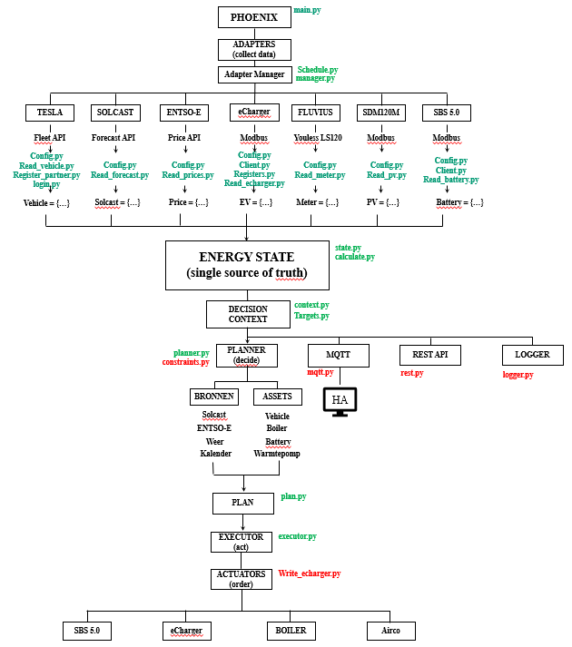

# PROJECT PHOENIX - HANDOVER DOCUMENT

1. Doel van dit document

# 1. Doel van dit document

Dit document beschrijft de architectuur, ontwerpfilosofie, ontwikkelomgeving en belangrijkste ontwerpbeslissingen van Project Phoenix.
Het is bedoeld als overdrachtsdocument voor een nieuwe ChatGPT-chat of ontwikkelaar, zodat de bestaande kennis en gemaakte keuzes behouden blijven.
Het doel is niet alleen uit te leggen **hoe** Phoenix werkt, maar vooral **waarom** bepaalde ontwerpbeslissingen zijn genomen. 
Hierdoor worden reeds gemaakte keuzes niet telkens opnieuw ter discussie gesteld en kan de verdere ontwikkeling consistent verlopen.
Dit document dient als de technische referentie voor het project. Bij verschillen tussen een nieuw voorstel en dit document heeft de beschreven architectuur voorrang,
 tenzij er een duidelijke technische reden bestaat om daarvan af te wijken.
De broncode in Visual Studio Code blijft altijd de bron van waarheid voor de implementatie. Dit document beschrijft de architectuur, 
de ontwerpkeuzes en de uitgangspunten waarop die implementatie is gebaseerd.

2. Projectdoel

# 2. Projectdoel

Project Phoenix is een autonoom Energy Management System (EMS) dat draait op een Raspberry Pi en het energieverbruik binnen een woning intelligent aanstuurt.
Het systeem verzamelt gegevens uit verschillende bronnen, zoals de elektriciteitsmeter, omvormer, thuisbatterij, laadpaal, elektrische auto, 
weersvoorspellingen en dynamische energieprijzen. Op basis van deze informatie bepaalt Phoenix zelfstandig welke acties nodig zijn om de beschikbare energie 
zo efficiënt mogelijk te benutten.
Phoenix is ontworpen als een generiek en modulair systeem waarin de verschillende onderdelen ieder een duidelijk afgebakende verantwoordelijkheid hebben. 
Hierdoor blijft de software eenvoudig uitbreidbaar en onderhoudbaar.
Het systeem neemt zijn beslissingen volledig zelfstandig. Home Assistant fungeert uitsluitend als gebruikersinterface voor visualisatie, monitoring en bediening, 
maar maakt geen deel uit van de besluitvorming.
Tijdens de ontwikkeling staan betrouwbaarheid, eenvoud en een duidelijke scheiding van verantwoordelijkheden centraal. 
Elke module heeft één specifieke taak, waardoor de architectuur overzichtelijk blijft en toekomstige uitbreidingen eenvoudig kunnen worden toegevoegd 
zonder bestaande onderdelen ingrijpend te wijzigen.

3. Ontwikkelomgeving
   3.1 Hardware

   Project Phoenix draait op een Raspberry Pi die 24 uur per dag actief is als centrale besturing van het Energy Management System.
   De Raspberry Pi verzorgt de volledige verwerking van gegevens, de besluitvorming en de communicatie met alle aangesloten systemen. 
   Er wordt geen gebruikgemaakt van externe cloudservices voor de kernfunctionaliteit van het systeem.
   De Raspberry Pi communiceert onder andere met:

    - Slimme elektriciteitsmeter (Youless)
    - SMA SBS thuisbatterij
    - SMA Sunny Boy omvormer
    - eCharger laadpaal
    - Tesla API
    - Solcast (zonneproductievoorspelling)
    - ENTSO-E (dynamische elektriciteitsprijzen)
    - Home Assistant via MQTT

   Door alle logica lokaal uit te voeren blijft Phoenix onafhankelijk van externe systemen en blijft het systeem ook functioneren wanneer internetdiensten 
   tijdelijk niet beschikbaar zijn. Alleen voor gegevens die van externe bronnen afkomstig zijn, zoals weersvoorspellingen, energieprijzen en voertuiggegevens, 
   is een internetverbinding noodzakelijk.
 
   3.2 Besturingssysteem
   ## 3.2 Besturingssysteem

   Project Phoenix draait op Raspberry Pi OS met een standaard Linux-omgeving. Het systeem is ontwikkeld als een native Python-applicatie en maakt geen gebruik 
   van containertechnologie zoals Docker.
   De keuze voor een native installatie is bewust gemaakt om de software eenvoudig te houden, het beheer te vereenvoudigen en de beschikbare systeembronnen 
   optimaal te benutten. Hierdoor is de volledige omgeving transparant en eenvoudig te onderhouden met de standaard Linux-tools.
   Phoenix wordt gestart als een reguliere applicatie en maakt gebruik van de standaard voorzieningen van het besturingssysteem voor onder andere netwerkcommunicatie, 
   bestandstoegang en procesbeheer.
   De software is ontworpen om langdurig stabiel te functioneren zonder afhankelijk te zijn van aanvullende virtualisatie- of containerlagen.

   3.3 Python

## 3.3 Python

   Project Phoenix is volledig ontwikkeld in Python. De applicatie bestaat uit een verzameling losse modules die samen de verschillende onderdelen van het 
   Energy Management System vormen.
   Er wordt bewust gekozen voor een eenvoudige en overzichtelijke Python-architectuur zonder complexe frameworks. De nadruk ligt op leesbare code, 
   duidelijke verantwoordelijkheden en een modulaire opbouw, zodat nieuwe functionaliteit eenvoudig kan worden toegevoegd zonder bestaande onderdelen ingrijpend te wijzigen.
   Elke module heeft één duidelijk afgebakende verantwoordelijkheid. De communicatie tussen modules verloopt via goed gedefinieerde gegevensstructuren, 
   waardoor de onderlinge afhankelijkheden beperkt blijven.
   De broncode wordt ontwikkeld en onderhouden in Visual Studio Code. De broncode is altijd de bron van waarheid; dit document beschrijft de 
   architectuur en de ontwerpkeuzes waarop de implementatie is gebaseerd.

   3.4 Waarom geen Docker

## 3.4 Waarom geen Docker

   Project Phoenix wordt bewust als een native Python-applicatie uitgevoerd en maakt geen gebruik van Docker of andere containertechnologie.
   De belangrijkste reden hiervoor is eenvoud. Phoenix draait op één Raspberry Pi met een duidelijk afgebakende taak: het verzamelen van gegevens, 
   het nemen van beslissingen en het aansturen van energiesystemen. De extra complexiteit van containers biedt voor deze toepassing geen wezenlijke voordelen.
   Door de software rechtstreeks op het besturingssysteem uit te voeren blijven installatie, configuratie, logging, updates en foutopsporing overzichtelijk. 
   Alle onderdelen zijn direct toegankelijk met de standaard Linux-hulpmiddelen, waardoor beheer en onderhoud eenvoudiger zijn.
   Daarnaast voorkomt een native installatie extra lagen tussen de applicatie en de onderliggende hardware. 
   Dit maakt de communicatie met lokale apparaten, zoals Modbus- en netwerkapparatuur, transparant en eenvoudig te diagnosticeren.
   De keuze om geen Docker te gebruiken is een bewuste ontwerpbeslissing en sluit aan bij de algemene ontwikkelfilosofie van Project Phoenix: 
   kies de eenvoudigste oplossing die betrouwbaar, onderhoudbaar en toekomstbestendig is.

4. Ontwikkelfilosofie

   Project Phoenix wordt ontwikkeld volgens een aantal vaste ontwerpprincipes die de software overzichtelijk, betrouwbaar en eenvoudig onderhoudbaar houden. 
   Nieuwe functionaliteit moet altijd binnen deze uitgangspunten passen.

   ### Eenvoud boven complexiteit
   Voor iedere functie wordt gekozen voor de eenvoudigste oplossing die aan de gestelde eisen voldoet. 
   Onnodige abstracties, complexe frameworks en overbodige ontwerp­patronen worden vermeden.

### Eén verantwoordelijkheid per module
   Iedere module heeft één duidelijk afgebakende taak. Hierdoor blijft de code overzichtelijk, zijn modules eenvoudig te testen en kunnen onderdelen 
   onafhankelijk van elkaar worden aangepast of uitgebreid.

### Duidelijke scheiding van verantwoordelijkheden
   De verschillende onderdelen van Phoenix hebben ieder een eigen verantwoordelijkheid.

    - Readers verzamelen gegevens.
    - `calculate()` voert uitsluitend berekeningen uit.
    - Decision Context bevat alleen feitelijke informatie.
    - Targets beschrijven de gewenste situatie.
    - Constraints leggen systeembeperkingen vast.
    - De Planner bepaalt wat er moet gebeuren.
    - De Executor bepaalt hoe dit wordt uitgevoerd.
    - Actuators communiceren uitsluitend met apparaten.

   Besluitvorming vindt uitsluitend plaats binnen de Planner.

### Energie State als centrale bron van waarheid
   Alle actuele gegevens worden opgeslagen in de Energy State. Andere modules lezen deze gegevens, maar beheren geen eigen kopieën van dezelfde informatie. 
   Hierdoor bestaat er altijd één consistente toestand van het systeem.

### Modulaire uitbreidbaarheid
   Nieuwe apparaten, readers, actuators en functionaliteit moeten kunnen worden toegevoegd zonder bestaande architectuur ingrijpend aan te passen. 
   De software is daarom modulair opgebouwd.

### Lokale autonomie
   Phoenix neemt alle energiebeslissingen lokaal op de Raspberry Pi. Externe systemen, waaronder Home Assistant, dienen uitsluitend voor visualisatie, 
   monitoring en bediening en maken geen onderdeel uit van de besluitvorming.

### Leesbare code
   Leesbaarheid heeft prioriteit boven compacte of slimme programmeerconstructies. 
   Duidelijke namen, eenvoudige functies en een logische projectstructuur hebben de voorkeur boven complexe optimalisaties.

### Architectuur vóór implementatie
   Nieuwe functionaliteit wordt eerst architectonisch uitgewerkt voordat de implementatie begint. 
   Pas wanneer verantwoordelijkheden, interfaces en gegevensstromen duidelijk zijn vastgelegd, wordt de code geschreven.

### Bron van waarheid
   De broncode in Visual Studio Code is altijd de bron van waarheid voor de implementatie. 
   Dit document beschrijft de architectuur en de ontwerpkeuzes waarop die implementatie is gebaseerd.

5. Werkwijze tijdens chats

   Project Phoenix wordt stapsgewijs ontwikkeld. Nieuwe functionaliteit wordt niet direct geïmplementeerd, maar eerst architectonisch uitgewerkt en besproken. 
   Pas nadat de architectuur is goedgekeurd, wordt begonnen met de implementatie.

## Kleine ontwikkelstappen

   Ontwikkeling vindt plaats in kleine, overzichtelijke stappen. Iedere stap heeft een duidelijk doel en is eenvoudig te controleren voordat de volgende stap wordt gezet.

## Architectuur vóór code

   Nieuwe onderdelen worden eerst ontworpen. Hierbij worden verantwoordelijkheden, interfaces, gegevensstromen en afhankelijkheden vastgesteld. 
   De implementatie volgt pas nadat hierover overeenstemming is bereikt.

## Visual Studio Code als bron van waarheid

   De projectbestanden in Visual Studio Code vormen altijd de actuele implementatie van Project Phoenix. 
   Tijdens discussies, reviews en documentatie is de code in Visual Studio Code leidend.

## Versiebeheer

   Project Phoenix wordt beheerd met Git. Na iedere afgeronde en geteste wijziging wordt een commit gemaakt met een duidelijke en beschrijvende commitboodschap.

   De GitHub-repository vormt de centrale opslagplaats van de broncode en de projectdocumentatie. De repository fungeert als versiebeheer, back-up en samenwerkingsplatform.

   Ontwikkeling vindt plaats in kleine, afgeronde stappen. Iedere stap wordt eerst geïmplementeerd en gecontroleerd voordat deze wordt vastgelegd in Git en gepubliceerd naar GitHub.

## Volledige bestanden

   Wijzigingen worden bij voorkeur aangeleverd als complete functies of complete modules in plaats van losse codefragmenten. 
   Hierdoor blijven wijzigingen eenvoudig over te nemen en ontstaat minder kans op fouten tijdens het samenvoegen.

## Documentatie als onderdeel van de ontwikkeling

   Belangrijke architectuurbeslissingen worden vastgelegd in de projectdocumentatie. 
   Hierdoor blijft de achterliggende motivatie behouden en hoeven eerder gemaakte keuzes niet opnieuw te worden besproken.

   Het handover-document wordt gedurende de ontwikkeling bijgewerkt zodat het altijd een actuele beschrijving geeft van de architectuur, 
   ontwerpfilosofie en belangrijkste ontwerpbeslissingen.

## Consistentie boven snelheid

   Bij nieuwe voorstellen staat consistentie met de bestaande architectuur voorop. 
   Een oplossing die beter aansluit bij de ontwerpfilosofie heeft de voorkeur boven een snellere of complexere implementatie.

6. Architectuuroverzicht

   Project Phoenix is opgebouwd uit een verzameling zelfstandige modules, waarbij iedere module één duidelijk afgebakende verantwoordelijkheid heeft. 
   Samen vormen deze modules de volledige verwerkingsketen van het Energy Management System.
   De architectuur is gebaseerd op een logische gegevensstroom. Meetgegevens worden verzameld, verwerkt tot een actuele systeemsituatie, 
   vertaald naar een plan en uiteindelijk uitgevoerd door de daarvoor bestemde actuators. Iedere module is uitsluitend verantwoordelijk voor zijn eigen taak en kent alleen de informatie die daarvoor noodzakelijk is.
   Door deze scheiding van verantwoordelijkheden blijft de software overzichtelijk, eenvoudig uitbreidbaar en goed onderhoudbaar.

## Verwerkingsketen

7. Datastroom

   Binnen Project Phoenix worden gegevens stapsgewijs verwerkt van ruwe meetgegevens naar concrete apparaatbesturing. 
   Iedere module heeft hierin een eigen verantwoordelijkheid en verwerkt uitsluitend de informatie die voor zijn taak noodzakelijk is.

   De logische gegevensstroom bestaat uit de volgende stappen:

    1. **Readers** verzamelen actuele gegevens van externe systemen en apparaten.
    2. De verzamelde gegevens worden opgeslagen in de **Energy State**, die de centrale bron van waarheid vormt.
    3. De module **calculate()** voert afgeleide berekeningen uit op basis van de beschikbare gegevens.
    4. Op basis van de Energy State wordt de **Decision Context** opgebouwd. Deze bevat uitsluitend feitelijke informatie over de actuele situatie.
    5. De gewenste systeemdoelen worden vastgelegd in **Targets**. Eventuele beperkingen worden beschreven in **Constraints**.
    6. De **Planner** combineert de actuele situatie met de gewenste doelen en stelt een **Plan** op.
    7. De **Executor** vertaalt het Plan naar concrete opdrachten voor de verschillende **Actuators**.
    8. De Actuators communiceren met de aangesloten apparaten en voeren de gevraagde acties uit.

   Naast deze verwerkingsketen bestaat een afzonderlijke informatiestroom voor externe systemen. 
   De actuele Energy State, Decision Context en het Plan kunnen worden gepubliceerd via MQTT, beschikbaar worden gesteld via REST en worden vastgelegd in de logbestanden. 
   Deze uitvoer heeft uitsluitend een informerend karakter en maakt geen deel uit van de besluitvorming.
   Home Assistant vormt de gebruikersinterface van Project Phoenix. 
   Via MQTT ontvangt Home Assistant de actuele status van het systeem voor visualisatie, monitoring en bediening. 
   Eventuele opdrachten vanuit Home Assistant worden door Phoenix verwerkt binnen de bestaande architectuur; de energiebeslissingen worden altijd door Phoenix zelf genomen.
   De gegevensstroom beschrijft de logische samenhang tussen de verschillende modules. 
   De daadwerkelijke uitvoering wordt gecoördineerd door de Manager, die de verschillende onderdelen volgens het ingestelde schema aanroept.

8. Uitvoerlaag

   Naast de interne besluitvorming stelt Project Phoenix informatie beschikbaar aan externe systemen. 
   Deze uitvoer is uitsluitend bedoeld voor visualisatie, monitoring, integratie en diagnose en heeft geen invloed op de energiebeslissingen van het systeem.
   De uitvoerlaag bestaat uit drie onderdelen:

- **MQTT** 
   publiceert de actuele Energy State, Decision Context en het Plan. 
   MQTT vormt de primaire koppeling met Home Assistant, dat deze informatie gebruikt voor visualisatie, monitoring en bediening.

- **REST** 
   stelt informatie beschikbaar aan externe applicaties, dashboards en diagnostische hulpmiddelen. 
   Hierdoor kunnen gegevens ook buiten Home Assistant worden geraadpleegd.

- **Logger** 
   registreert gebeurtenissen, foutmeldingen en diagnostische informatie. 
   De logbestanden ondersteunen het monitoren van het systeem en het analyseren van eventuele problemen.

   De uitvoerlaag ontvangt uitsluitend informatie vanuit de interne modules van Phoenix. 
   Zij neemt geen beslissingen en beïnvloedt de interne gegevensverwerking of de werking van de Planner en Executor niet.

9. Home Assistant als toplaag

   Home Assistant vormt de gebruikersinterface van Project Phoenix. 
   Het biedt inzicht in de actuele toestand van het systeem en maakt interactie met de gebruiker mogelijk, maar maakt geen onderdeel uit van de besluitvorming.
   Project Phoenix functioneert volledig autonoom. 
   Alle energiebeslissingen worden lokaal genomen op basis van de beschikbare meetgegevens, berekeningen, doelen en beperkingen. 
   Home Assistant beïnvloedt deze besluitvorming niet.
   Via MQTT Discovery worden de verschillende entiteiten automatisch beschikbaar gemaakt in Home Assistant. Hierdoor kan de gebruiker onder andere:

    - de actuele Energy State bekijken;
    - de Decision Context volgen;
    - het huidige Plan bekijken;
    - systeemstatus en foutmeldingen monitoren;
    - instellingen en doelwaarden aanpassen (voor zover ondersteund).

   Home Assistant fungeert daarmee als visualisatie-, configuratie- en bedieningslaag boven op Project Phoenix. De logica voor energiebeheer blijft volledig binnen Phoenix zelf.

   Door deze scheiding van verantwoordelijkheden blijft Phoenix onafhankelijk van Home Assistant. Het systeem kan zelfstandig blijven functioneren wanneer Home Assistant tijdelijk niet beschikbaar is, terwijl Home Assistant op zijn beurt eenvoudig kan worden uitgebreid zonder wijzigingen aan de interne architectuur van Phoenix.

10. Moduleoverzicht
    
    ## 10.1 main.py
   `main.py` vormt het startpunt van Project Phoenix en coördineert de uitvoering van de EMS-pipeline.
   Zie de [modulebeschrijving](docs/modules/main.md).

   ## 10.2 manager.py
   `manager.py` beheert de planning en uitvoering van alle readers volgens het ingestelde pollschema.
   Zie de [modulebeschrijving](docs/modules/manager.md).

   ## 10.3 schedule.py
   `schedule.py` bepaalt wanneer iedere reader moet worden uitgevoerd.
   Zie de [modulebeschrijving](docs/modules/schedule.md).

   ## 10.4 state.py
   `state.py` beheert de centrale Energy State van Project Phoenix.
   Zie de [modulebeschrijving](docs/modules/state.md).

   ## 10.5 calculate.py
   `calculate.py` berekent afgeleide waarden op basis van de actuele Energy State.
   Zie de [modulebeschrijving](docs/modules/calculate.md).

   ## 10.6 context.py
   `context.py` bouwt de Decision Context op vanuit de actuele systeemsituatie.
   Zie de [modulebeschrijving](docs/modules/context.md).

   ## 10.7 targets.py
   `targets.py` definieert de gewenste systeemdoelen voor de Planner.
   Zie de [modulebeschrijving](docs/modules/targets.md).

   ## 10.8 constraints.py
   `constraints.py` beschrijft de beperkingen waarbinnen de Planner moet opereren.
   Zie de [modulebeschrijving](docs/modules/constraints.md).

   ## 10.9 planner.py
   `planner.py` stelt op basis van de actuele situatie en de doelen een uitvoerbaar Plan op.
   Zie de [modulebeschrijving](docs/modules/planner.md).

   ## 10.10 plan.py
   `plan.py` definieert de generieke gegevensstructuur waarmee de Planner en Executor communiceren.
   Zie de [modulebeschrijving](docs/modules/plan.md).

   ## 10.11 executor.py
   `executor.py` vertaalt het Plan naar concrete opdrachten voor de actuators.
   Zie de [modulebeschrijving](docs/modules/executor.md).

   ## 10.12 readers
   De readers verzamelen actuele gegevens van apparaten en externe gegevensbronnen.
   Zie de [modulebeschrijving](docs/modules/readers.md).

   ## 10.13 actuators
   De actuators verzorgen uitsluitend de communicatie met de aangesloten apparaten.
   Zie de [modulebeschrijving](docs/modules/actuators.md).

   ## 10.14 mqtt.py
   `mqtt.py` verzorgt de MQTT-communicatie tussen Phoenix en Home Assistant.
   Zie de [modulebeschrijving](docs/modules/mqtt.md).

   ## 10.15 rest.py
   `rest.py` stelt gegevens beschikbaar aan externe applicaties en diagnostische hulpmiddelen.
   Zie de [modulebeschrijving](docs/modules/rest.md).

   ## 10.16 logger.py
   `logger.py` registreert gebeurtenissen en foutmeldingen voor logging en diagnose.
   Zie de [modulebeschrijving](docs/modules/logger.md).

   ## 10.17 config.py
   `config.py` bevat de centrale configuratie van Project Phoenix.
   Zie de [modulebeschrijving](docs/modules/config.md).
    
11. Polling en refreshbeleid

# 11. Polling en refreshbeleid

   Project Phoenix werkt volledig op basis van periodieke polling. Iedere reader wordt volgens een vast schema uitgevoerd dat is afgestemd op de eigenschappen van de betreffende gegevensbron.

   Er wordt bewust geen gebruikgemaakt van event-driven communicatie of retry-mechanismen. De meeste energiegegevens veranderen relatief langzaam, waardoor periodieke polling voldoende is en de software eenvoudig, betrouwbaar en voorspelbaar blijft.

   Bij het opstarten van Phoenix wordt iedere reader éénmaal uitgevoerd om de Energy State zo snel mogelijk te vullen. Daarna bepaalt de Scheduler wanneer iedere reader opnieuw wordt aangeroepen.

   De verschillende readers hebben ieder hun eigen polling- of refreshbeleid:

    | Gegevensbron       | Frequentie         |
    |--------------------|--------------------|
    | Youless (Grid)     | Iedere 15 seconden |
    | eCharger           | Iedere 30 seconden |
    | SMA Sunny Boy (PV) | Iedere 30 seconden |
    | SMA SBS (Battery)  | Iedere 5 minuten   |
    | Tesla API          | Iedere 10 minuten  |
    | Solcast            | Alleen bij opstart |
    | ENTSO-E            | Alleen bij opstart |

   Solcast en ENTSO-E vormen een uitzondering op de reguliere polling. Deze gegevens veranderen slechts beperkt gedurende de dag en worden daarom uitsluitend tijdens het opstarten van Phoenix opgehaald. De opgehaalde gegevens blijven gedurende de runtime beschikbaar in de Energy State.

   Na iedere poging wordt het tijdstip van de laatste uitvoering geregistreerd, ongeacht of de reader succesvol was. Hierdoor blijft het pollschema voorspelbaar en ontstaan geen verschuivingen in de planning.

   Wanneer een reader tijdelijk geen gegevens kan ophalen, blijft de laatst bekende informatie beschikbaar in de Energy State. Modules zoals `calculate()` zijn ontworpen om ontbrekende (`None`) waarden veilig te verwerken, zodat het systeem operationeel blijft.

   Deze pollingstrategie sluit aan bij de ontwerpfilosofie van Project Phoenix: eenvoud, betrouwbaarheid en voorspelbaar gedrag hebben de voorkeur boven complexe foutafhandeling of automatische retry-mechanismen.

12. Foutafhandeling

# 12. Foutafhandeling

   Project Phoenix is ontworpen om ook bij tijdelijke storingen zo veel mogelijk operationeel te blijven. Het systeem probeert niet iedere fout direct op te lossen, maar is erop gericht om de overige functionaliteit zonder onderbreking voort te zetten.

   Wanneer een reader tijdelijk geen gegevens kan ophalen, heeft dit geen invloed op de werking van de overige readers. Iedere reader functioneert onafhankelijk en een storing in één gegevensbron blokkeert de rest van het systeem niet.

   Er worden bewust geen automatische retry-mechanismen toegepast. Na een mislukte uitlezing wordt de volgende poging uitgevoerd volgens het normale polling- of refreshschema. Hierdoor blijft het gedrag van het systeem eenvoudig, voorspelbaar en goed reproduceerbaar.

   De Energy State blijft altijd beschikbaar. Ontbrekende gegevens worden weergegeven als `None` of blijven, indien van toepassing, behouden als laatst bekende waarde. Modules zoals `calculate()` zijn ontworpen om veilig met ontbrekende gegevens om te gaan.

   Fouten en uitzonderingen worden geregistreerd door de Logger, zodat problemen achteraf kunnen worden geanalyseerd zonder de normale werking van het systeem te verstoren.

   Door deze aanpak blijft Project Phoenix robuust bij tijdelijke communicatieproblemen, terwijl de architectuur eenvoudig en onderhoudbaar blijft.

13. Bekende beperkingen

   Project Phoenix is ontwikkeld voor een specifieke thuisinstallatie. Een aantal externe systemen kent beperkingen die niet door Phoenix zelf kunnen worden opgelost. Deze zijn hieronder beschreven.

   ## 13.1 SBS5.0 communicatie

   De SMA Sunny Boy Storage 5.0 biedt slechts een beperkt aantal gegevens via Modbus TCP. Sommige informatie is niet beschikbaar of wordt niet met de gewenste frequentie bijgewerkt. Phoenix is daarom afhankelijk van de gegevens die de omvormer zelf beschikbaar stelt.

   ## 13.2 Tesla API

   De Tesla API is een cloudservice en kan onderhevig zijn aan wijzigingen, tijdelijke storingen of rate limiting. Daarnaast kan een voertuig in slaapstand staan, waardoor gegevens niet altijd direct beschikbaar zijn. Phoenix houdt hier rekening mee door de Tesla-reader met een relatief lage frequentie uit te voeren.

   ## 13.3 Solcast

   Solcast levert weers- en productieprognoses die slechts enkele keren per dag worden bijgewerkt. Daarom worden deze gegevens uitsluitend bij het opstarten van Phoenix opgehaald en vervolgens gedurende de runtime gebruikt.

   ## 13.4 ENTSO-E

   ENTSO-E publiceert elektriciteitsprijzen eenmaal per dag. Omdat deze gegevens gedurende de dag niet veranderen, worden ze uitsluitend bij het opstarten van Phoenix opgehaald en daarna gebruikt voor de verdere besluitvorming.

14. Home Assistant integratie

   Project Phoenix is ontworpen om zelfstandig alle energiebeslissingen te nemen. Home Assistant fungeert uitsluitend als gebruikersinterface en automatiseringsplatform.

   De integratie met Home Assistant verloopt primair via MQTT Discovery. Hierdoor worden sensoren, binaire sensoren, knoppen en andere entiteiten automatisch beschikbaar zonder handmatige configuratie in Home Assistant.

   Phoenix publiceert onder andere:

    - actuele meetwaarden uit de Energy State;
    - berekende waarden uit `calculate()`;
    - informatie uit de Decision Context;
    - de actuele planning;
    - systeemstatus en diagnostische informatie.

   Daarnaast kan Home Assistant opdrachten naar Phoenix sturen, bijvoorbeeld om een handmatige actie uit te voeren of een instelling te wijzigen. De uiteindelijke energiebeslissing blijft echter altijd bij Phoenix.

   De Home Assistant-configuratie blijft hierdoor beperkt tot dashboards, visualisaties, notificaties en automatiseringen. Alle energiegerelateerde logica bevindt zich binnen Project Phoenix.

   Door deze scheiding blijven zowel Project Phoenix als Home Assistant onafhankelijk onderhoudbaar en kunnen wijzigingen aan de gebruikersinterface worden doorgevoerd zonder invloed op de interne werking van het EMS.

15. MQTT Discovery

   Project Phoenix maakt gebruik van MQTT Discovery om automatisch entiteiten beschikbaar te maken binnen Home Assistant. Hierdoor is geen handmatige configuratie van sensoren, schakelaars of andere entiteiten nodig.

   Bij het opstarten publiceert Phoenix de Discovery-configuratie voor alle ondersteunde entiteiten. Home Assistant detecteert deze automatisch en voegt ze toe aan de configuratie.

   Na de Discovery-publicatie verstuurt Phoenix periodiek de actuele waarden via MQTT. Hierdoor blijven de weergegeven gegevens in Home Assistant automatisch bijgewerkt.

   MQTT Discovery wordt gebruikt voor onder andere:

    - sensoren;
    - binaire sensoren;
    - knoppen;
    - schakelaars;
    - numerieke instellingen;
    - selecties;
    - tekstentiteiten.

   De implementatie volgt de officiële MQTT Discovery-specificatie van Home Assistant. Hierdoor blijven de configuratie en uitbreidingen eenvoudig te onderhouden.

   Alle technische details over de implementatie, MQTT-topics en payloads zijn opgenomen in `docs/modules/mqtt.md`.

16. Huidige projectstatus

   Op het moment van schrijven bevindt Project Phoenix zich in een vergevorderd ontwikkelstadium. De architectuur is vastgesteld en de belangrijkste softwarecomponenten zijn ontworpen en grotendeels geïmplementeerd.

   De logische gegevensstroom van readers naar actuators is vastgelegd en vormt de basis voor de verdere ontwikkeling. De scheiding tussen Energy State, Decision Context, Planner, Executor en de verschillende uitvoerlagen is definitief.

   De documentatie is opgesplitst in een centrale handover en afzonderlijke modulebeschrijvingen, zodat de architectuur en implementatie onafhankelijk van elkaar kunnen worden onderhouden.

   De resterende werkzaamheden bestaan voornamelijk uit het afronden van de implementatie, het uitgebreid testen van alle scenario's en het optimaliseren van de besluitvorming binnen het Energy Management System.

   Project Phoenix heeft daarmee een stabiele architectonische basis waarop toekomstige uitbreidingen gecontroleerd kunnen worden gerealiseerd.

17. Toekomstige uitbreidingen

   De architectuur van Project Phoenix is modulair opgezet, zodat nieuwe functionaliteit kan worden toegevoegd zonder ingrijpende wijzigingen aan de bestaande software.

   Mogelijke toekomstige uitbreidingen zijn onder andere:

    - ondersteuning voor aanvullende readers en actuators;
    - uitbreiding van de Planner met geavanceerdere optimalisatiestrategieën;
    - ondersteuning voor dynamische configuratie zonder herstart van de applicatie;
    - uitgebreidere REST-functionaliteit voor externe integraties;
    - aanvullende diagnostische- en monitoringsmogelijkheden;
    - ondersteuning voor nieuwe Home Assistant-entiteiten;
    - uitbreiding van de Decision Context met extra informatiebronnen;
    - ondersteuning voor aanvullende energiebronnen, verbruikers of opslagtechnieken.

   Bij iedere uitbreiding blijft het uitgangspunt dat de bestaande architectuur behouden blijft. Nieuwe functionaliteit wordt toegevoegd door nieuwe modules of uitbreidingen van bestaande modules, zonder de logische gegevensstroom van Project Phoenix te doorbreken.

   Hierdoor blijft de software overzichtelijk, onderhoudbaar en eenvoudig verder te ontwikkelen.

18. Ontwerpbeslissingen en motivatie

   Dit hoofdstuk beschrijft de belangrijkste ontwerpkeuzes die tijdens de ontwikkeling van Project Phoenix zijn gemaakt. De nadruk ligt op de motivatie achter deze keuzes. De technische uitwerking is beschreven in de voorgaande hoofdstukken en de afzonderlijke moduledocumentatie.

   ## 18.1 Waarom geen Docker
   De software draait rechtstreeks op Raspberry Pi OS. Hierdoor blijft de installatie eenvoudig, is hardware direct bereikbaar en wordt onnodige complexiteit vermeden.

   ## 18.2 Waarom polling
   Vrijwel alle energiegegevens veranderen langzaam. Periodieke polling levert voorspelbaar gedrag op en voorkomt complexe event-driven architecturen.

   ## 18.3 Waarom geen retries
   Een mislukte uitlezing is meestal tijdelijk. Door te wachten tot de volgende geplande polling blijft het systeem eenvoudig en ontstaat geen extra foutlogica.

   ## 18.4 Waarom Energy State
   Alle actuele systeeminformatie wordt op één centrale plaats opgeslagen. Hierdoor werken alle modules met dezelfde consistente gegevens.

   ## 18.5 Waarom Decision Context
   De Planner ontvangt uitsluitend informatie die nodig is om een beslissing te nemen. Hierdoor blijft de beslislogica losgekoppeld van de ruwe metingen.

   ## 18.6 Waarom calculate()
   Afgeleide waarden worden éénmaal berekend en daarna door alle modules hergebruikt. Dit voorkomt dubbele berekeningen en houdt de code overzichtelijk.

   ## 18.7 Waarom Targets
   Gewenste doelen worden gescheiden van de actuele toestand. Daardoor kan de Planner eenvoudig verschillende situaties beoordelen.

   ## 18.8 Waarom Constraints
   Beperkingen worden centraal beheerd zodat veiligheidsregels en systeemlimieten niet verspreid door de software voorkomen.

   ## 18.9 Waarom Planner en Executor
   Door plannen en uitvoeren te scheiden blijft de besluitvorming onafhankelijk van de apparaatbesturing.

   ## 18.10 Waarom Plan
   Het Plan vormt een vaste interface tussen Planner en Executor. Beide modules blijven daardoor onafhankelijk van elkaar.

   ## 18.11 Waarom Readers en Actuators
   Het scheiden van invoer en uitvoer maakt het eenvoudiger om apparaten toe te voegen of te vervangen zonder de rest van de software aan te passen.

   ## 18.12 Waarom MQTT
   MQTT biedt een eenvoudige en betrouwbare manier om gegevens met Home Assistant en andere systemen uit te wisselen.

   ## 18.13 Waarom Home Assistant als UI
   Alle energielogica blijft binnen Phoenix. Home Assistant verzorgt uitsluitend visualisatie, bediening en automatiseringen.

   ## 18.14 Waarom VS Code de bron van waarheid is
   De broncode vormt altijd de definitieve implementatie. Documentatie ondersteunt de ontwikkeling, maar mag nooit afwijken van de daadwerkelijke software.
